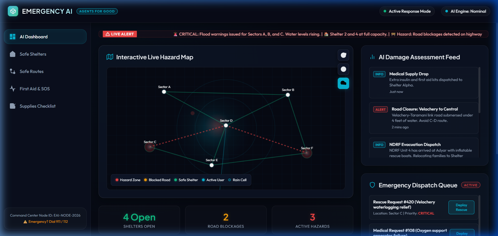
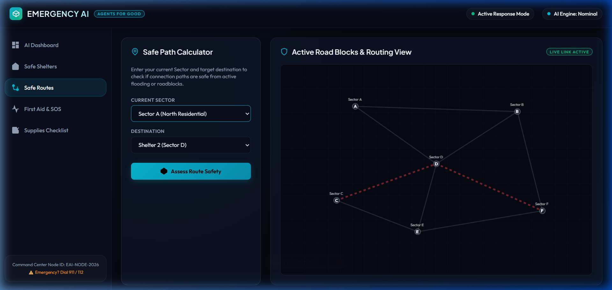
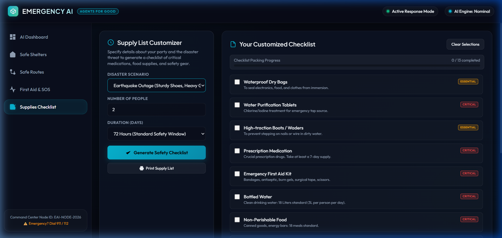

# Emergency AI - Disaster Assessment & Response Command Center

**Track**: Agents for Good  
**Target Scenario**: Rapid Response & Resource Allocation during Floods, Earthquakes, Cyclones, and Road Accidents.  
**Localization**: Adapted for Indian Emergency Services & Coastal Monsoons (NDRF, SDMA, 108 Emergency Services, Chennai Metropolitan Sectors).

---

## 📖 Project Overview

During major natural disasters (like seasonal monsoons in Chennai, landslides in mountain passes, or cyclones along the Bay of Bengal), communities face critical information breakdowns. People struggle to know:
1. **Where active, safe shelters are** and if they have available space.
2. **Which evacuation routes are safe** and which roads are blocked by floods or debris.
3. **How to get urgent medical triage** and contact government rescue dispatchers.
4. **What emergency supplies are needed** based on their family size and threat duration.

**Emergency AI** is a zero-dependency, glassmorphic, command-center dashboard that consolidates real-time disaster information, AI-powered emergency triage, dynamic road block routing, live canvas weather maps, and automated supply checklist compilation into a single, accessible visual screen.

---

## 🚀 Visual Features & Demos

### 1. Interactive Live Hazard Radar Map
Features a rotating radar scan, localized danger alerts, active shelter indicators, and animated rescue vehicles that travel from the central hub to incident sectors in real-time. Includes a toggleable **Weather Satellite Radar** to simulate rain/cyclone precipitation layers.

### 2. AI Triage & SOS Dispatcher
Allows users to input emergency descriptions (e.g., *"I am trapped in Sector C due to rising flood waters"*). The natural language parser analyzes keywords to score priority (Critical, High, Medium, Low), generates immediate first-aid instructions, logs the event to the command queue, and initiates simulated NDRF rescue boat dispatches.

### 3. Safe Path Router
A BFS (Breadth-First Search) routing solver that checks connected pathways between metropolitan sectors (Vyasarpadi, Adyar, Velachery, Nungambakkam, Guindy, Tambaram). It automatically routes around active hazard sectors (like Velachery floods or Tambaram bypass landslips) to trace the shortest safe route to open shelters.

### 4. Supplies Checklist Planner
Generates personalized checklist manifests based on the group size, duration (24 hrs to 7 days), and disaster scenario. Pre-populates critical items like **Aadhaar/Ration card records in waterproof files**, **Oral Rehydration Salts (ORS) packets**, and **water sterilizing chlorine tablets**.

---

## 🛠️ Project Structure & Tech Stack

This project is built using vanilla, lightweight frontend technologies designed to run offline or over low-bandwidth emergency links:

* **`index.html`**: Structure for the command grids, modular panels, and inline responsive SVG vector icons.
* **`style.css`**: State-of-the-art dark command center theme utilizing glassmorphism, responsive flex layouts, keyframe warnings, and CSS print media rules for physical checklist copies.
* **`app.js`**: Central application state, canvas drawing loops, pathfinding algorithms, regex triage processors, and checklist builders.
* **`images/`**: Project screenshots and maps.

---

## 🏃 How to Run Locally

Since this is a client-side web application, no complex node installation or web server setup is required:

1. Clone or download this repository.
2. Double-click the [index.html](file:///D:/capstone%20project/index.html) file to open the dashboard instantly in any modern web browser (Chrome, Firefox, Safari, Edge).
3. Switch tabs on the left navigation bar to access different modules.
