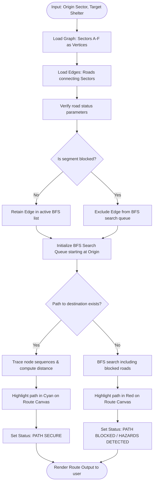
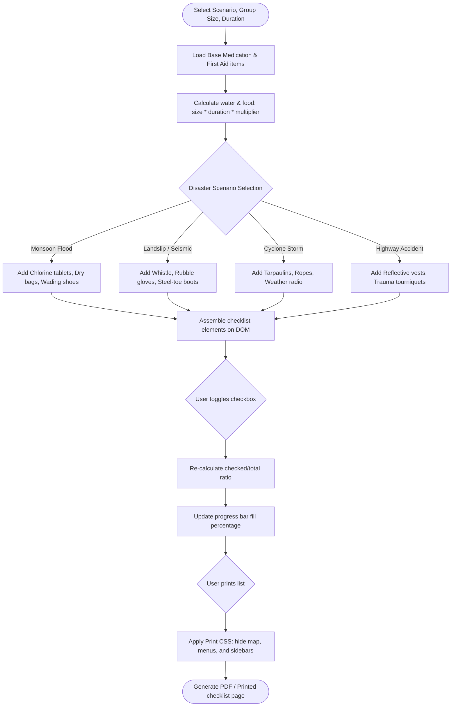

# Emergency AI - Process Workflows & Flow Diagrams

This document contains structural flowcharts mapping the core algorithmic operations and user interactions of the **Emergency AI** Command Console.

---

## 1. Overall System Architecture

The command center integrates three key asynchronous loops: the Map Visual Rendering loop, the User Decision / Pathfinding logic, and the AI Incident Triage processor.

---

## 2. SOS Emergency Triage & Dispatch Flow

This flowchart describes the automated pipeline triggered when a citizen submits an emergency request through the triage bot interface.

---

## 3. BFS Safe Route Calculator Flow

This diagram outlines how the pathfinder searches the sector graph to find a safe path to shelters while bypassing active disaster areas and landslides.

---

## 4. Emergency Supplies Configurator Flow

Details the logic used to create custom checklists and export/print them for physical packing.

