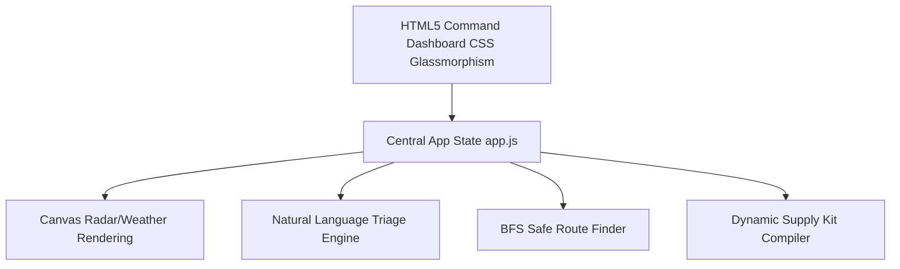
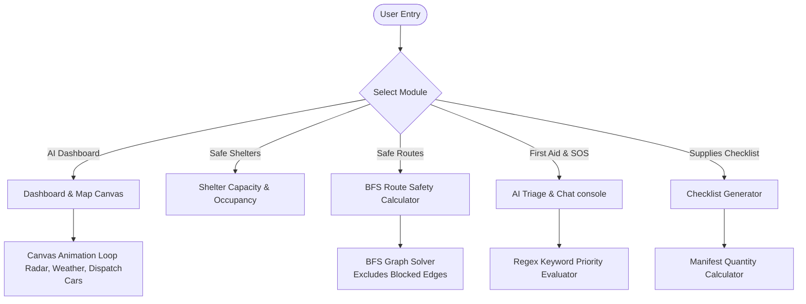
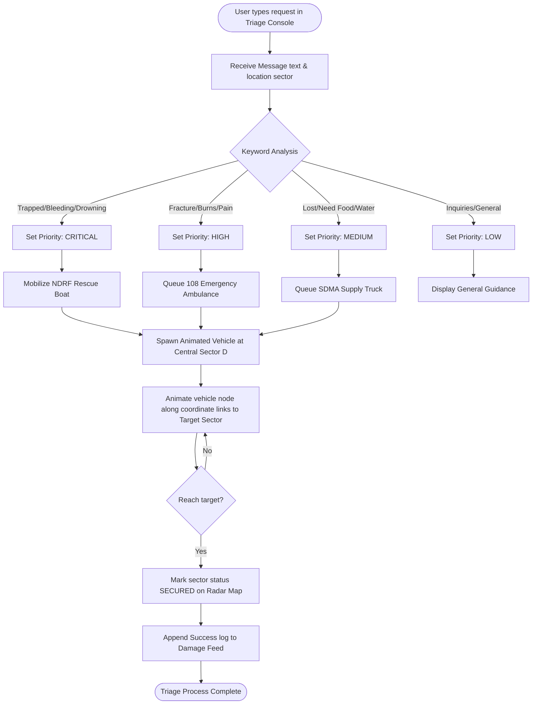
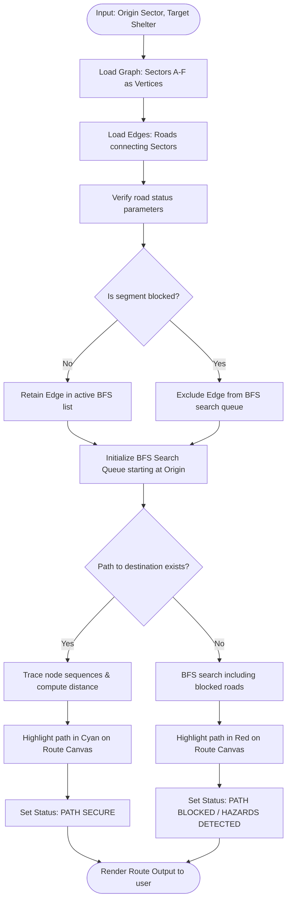

# Project Documentation: Emergency AI Command Console

**Track**: Agents for Good  
**Project Scope**: Capstone Project - Disaster Assessment & Response Command Center  
**Target Scenario**: Monsoons, Cyclones, Earthquakes, Landslides, and Road Accidents  
**Key Implementation**: Vanilla HTML5, CSS3, JS Canvas, and BFS Pathfinding Algorithms

---

## 1. Executive Summary / Abstract
In times of extreme weather events and natural disasters, cellular bandwidth collapses, power grids fail, and critical information becomes highly fragmented. Citizens find themselves stranded without clear guidance on safe evacuation routes, shelter capacities, medical hotlines, or custom supplies lists.

**Emergency AI** is a lightweight, responsive, client-side Command Console designed to provide real-time situational awareness and emergency support to both affected citizens and rescue coordinators. Built to prioritize performance on low-bandwidth emergency links or fully offline local intranet nodes, the console integrates visual mapping, automated pathfinding, natural language triage analysis, and supply optimization into a glassmorphic dashboard interface.

---

## 2. Problem Statement
During severe crises (e.g., Bay of Bengal Cyclones or Himalayan Landslips):
* **Evacuation Blindness**: Citizens make critical routing decisions without knowing which roads are blocked by floods or debris, leading to vehicle entrapments.
* **Shelter Disorganization**: Displaced families head to generic shelters without knowing if they have exceeded capacity, causing over-crowding in select shelters while others remain empty.
* **Paramedic Dispatch Bottlenecks**: Emergency centers are overwhelmed by high-call volumes. Responders cannot quickly classify critical trauma cases from basic supply requests, delaying life-saving support.
* **Supply Resource Deficits**: Citizens pack survival kits without factoring in threat-specific necessities (e.g., waders for flooding, whistles for landslides) or group-specific consumption rates (water/food duration counts).

---

## 3. Overall System Architecture

The command center integrates three key asynchronous loops: the Map Visual Rendering loop, the User Decision / Pathfinding logic, and the AI Incident Triage processor.

---

## 4. Detailed Module Workflows

### A. Live Hazard & Radar Map (Visual Layer)
* **Technology**: HTML5 Canvas 2D Rendering Context & RequestAnimationFrame.
* **Core Logic**: Draws a real-time spatial command overlay representing nodes (sectors) and links (highways). Active hazard circles (danger zones) pulse dynamically.
* **Weather Satellite Radar**: Integrates an overlay of shifting monsoon precipitation circles to visually track storm fronts.
* **Active Dispatch Vectors**: When a dispatch request is accepted, a rescue unit node is spawned at the central hub and moves along coordinate lines to the target sector in real-time.

---

### B. Safe Path Route Finder (Algorithm Layer)
* **Technology**: Breadth-First Search (BFS) graph traversal.
* **Core Logic**: Models local sectors as graph vertices and highways as edges. Roads marked as `blocked` (flooded or obstructed by debris) are dynamically excluded from search paths.
* **User Value**: Users input their current sector and desired shelter. The BFS algorithm calculates the shortest path that bypasses hazard sectors. If a connection is completely blocked, the system flags it as `INACCESSIBLE` and recommends alternative bypass corridors.

---

### C. Supplies Checklist Compiler (Optimization Layer)
* **Technology**: JavaScript state arrays and CSS Print styling rules.
* **Core Logic**: Accepts parameters for group count, threat duration, and disaster type. Generates target quantities (e.g., ORS sachet rations, water volumes) and threat-specific equipment (e.g., waders for flooding, whistle for landslides).
* **Print Utility**: Styled with `@media print` rules, allowing families to print physical copy checklists that exclude all menus, navigation sidebars, and active maps.

---

## 5. Technical Stack & Architecture Details
This project is built using vanilla, lightweight frontend technologies designed to run offline or over low-bandwidth emergency links:

* **Markup Layer**: Semantic HTML5 elements (`index.html`) using inline SVGs for responsive, crisp iconography loading without network dependencies.
* **Styling Layer**: Modern CSS3 (`style.css`) implementing variable tokens, glassmorphism, responsive grids, and print-media optimization overlays.
* **Execution & Routing Logic**: Client-side JavaScript (`app.js`) handling custom closures, BFS search solvers, regex triage analysis, canvas animations, and state binding listeners.

---

## 6. Social Impact & "Agents for Good" Value
* **Offline Resilience**: By executing entirely on the client-side (no external database queries or bulky JS frameworks), the console can be hosted locally on small battery-powered routers, emergency mesh networks, or cached offline on personal devices.
* **Load Reduction on First Responders**: Automating triage allows dispatch controllers to prioritize rescue boats for stranded individuals over routine resource requests.
* **Resource Optimization**: Directing citizens to high-vacancy shelters (like Guindy Delta) prevents overcrowding at central arenas (like Nungambakkam Beta).
* **Clear Action Guides**: Providing instant offline medical references (CPR, tourniquets) empowers citizens to act as immediate first responders.

---

## 7. Future Roadmap
1. **P2P Mesh Network Integration**: Utilizing WebRTC to share local shelter occupancy and hazard alerts directly between nearby mobile phones without cell towers.
2. **Offline GIS Integration**: Swapping the vector coordinate grid for offline-cached OpenStreetMap (OSM) tile rendering.
3. **SMS / USSD Gateway**: Enabling users with standard cellular connections to text their triage queries and receive automated routing replies.
